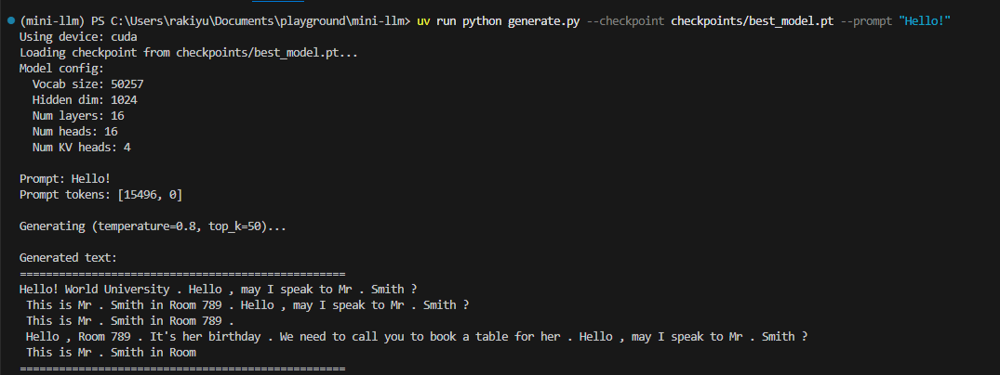

# Mini LLM

A simple 1B parameter LLM implementation using Grouped Query Attention (GQA) and Scaled Dot-Product Attention (SPDA/SDPA) with PyTorch.

## Features

- **Architecture**: Decoder-only Transformer with:
  - RMSNorm (using PyTorch's native `nn.RMSNorm`)
  - RoPE (Rotary Position Embeddings)
  - GQA (Grouped Query Attention) with 4x key/value head compression
  - SDPA (Scaled Dot-Product Attention) using PyTorch's `F.scaled_dot_product_attention`
  - SwiGLU Feed-Forward Network

- **Training**: 
  - Daily Dialog dataset for conversational AI
  - AdamW optimizer with cosine learning rate schedule
  - Gradient accumulation for larger effective batch sizes
  - Mixed precision support (via SDPA)

## Quick Start

### 1. Setup Environment

```bash
# Using uv (recommended)
uv sync

# Or using pip
pip install torch datasets transformers tiktoken numpy tqdm
```

### 2. Test Model

```bash
# Test model architecture
uv run python mini_llm/model.py

# Test data loading
uv run python mini_llm/data.py
```

### 3. Train

```bash
# Train with small config (~400M parameters)
uv run python run_train.py --config small --epochs 3

# Train with base config (~800M parameters, under 1B)
uv run python run_train.py --config base --epochs 3

# Or use train.py directly for full control
uv run python train.py \
    --dim 768 \
    --n_layers 12 \
    --n_heads 12 \
    --n_kv_heads 4 \
    --batch_size 2 \
    --gradient_accumulation_steps 8 \
    --epochs 3
```

### 4. Generate Text

```bash
uv run python generate.py \
    --checkpoint checkpoints/best_model.pt \
    --prompt "Hello, how are you today?" \
    --max_new_tokens 100 \
    --temperature 0.8
```
#### eg
```bash
uv run python generate.py --checkpoint checkpoints/best_model.pt --prompt "Hello!"
```


## Model Configurations

| Config | Dim | Layers | Heads | KV Heads | Params |
|--------|-----|--------|-------|----------|--------|
| tiny   | 512 | 8      | 8     | 2        | ~100M  |
| small  | 768 | 12     | 12    | 4        | ~400M  |
| base   | 1024| 16     | 16    | 4        | ~800M  |
| large  | 1280| 20     | 20    | 5        | ~1.5B  |

## Project Structure

```
mini-llm/
├── mini_llm/
│   ├── __init__.py
│   ├── model.py          # MiniLLM model implementation
│   └── data.py           # Data loading and preprocessing
├── train.py              # Training script
├── generate.py           # Text generation script
├── run_train.py          # Simple training launcher
├── pyproject.toml        # Project configuration
└── README.md
```

## Key Implementation Details

### Grouped Query Attention (GQA)

GQA reduces memory bandwidth and computation by sharing key/value heads across multiple query heads. In this implementation:

- `n_heads = 16` (query heads)
- `n_kv_heads = 4` (key/value heads)
- Each KV head is shared by 4 query heads

### Scaled Dot-Product Attention (SDPA)

Uses PyTorch's native `F.scaled_dot_product_attention` which automatically:
- Uses Flash Attention when available
- Falls back to memory-efficient attention
- Supports causal masking for autoregressive generation

### RoPE (Rotary Position Embeddings)

Pre-computed frequency tensors for efficient position encoding, applied to Q and K before attention.

## Hardware Requirements

- **GPU**: NVIDIA GPU with CUDA support (tested on CUDA 12.4)
- **Memory**: 
  - tiny config: ~2GB VRAM
  - small config: ~4GB VRAM
  - base config: ~8GB VRAM
  - large config: ~16GB VRAM

## License

MIT
